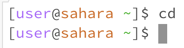
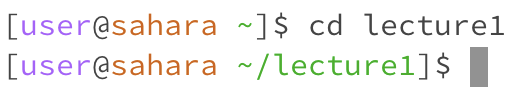
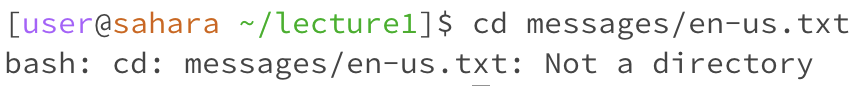
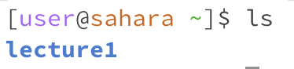
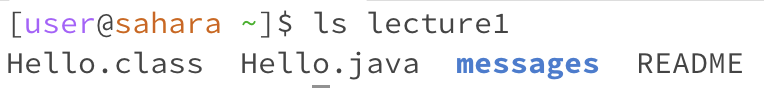
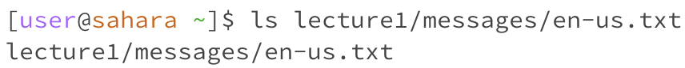
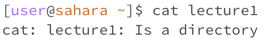
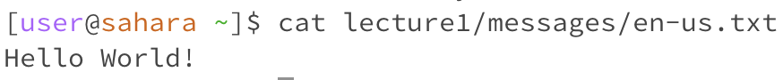

# Lab Report 1 - Remote Access and FileSystem (Week 1)
**Example 1 - cd No Arguments**  

---

**Example 2 - cd Directory**  

---

**Example 2 - cd File**  

---

**Example 4 - ls No Arguments**  

---

**Example 5 - ls Directory**  

---

**Example 6 - ls File**  

---

**Example 7 - cat No Arguments**  

---

**Example 8 - cat Directory**  

---

**Example 9 - cat File**  

---

