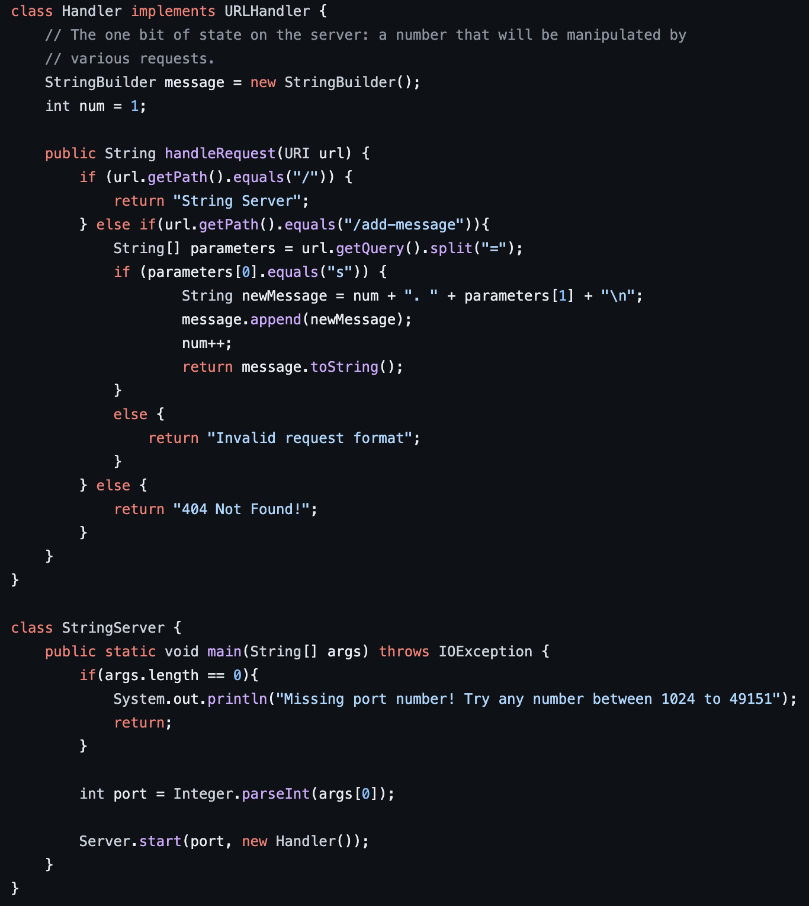
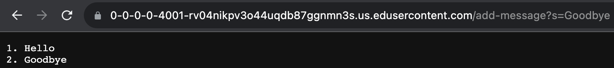

# Lab Report 2 - Servers and SSH Keys (Week 3)
**String Server Code**  \
  

---

**Add Messages Example 1** \
  \
The method in the code being called is `handleRequests`. For this add, `num = 1` so `newMessage = 1. Hello`, and this is appended to message. After this request, `num` is updated to equal 2. 

---

**Add Messages Example 2** \
  \
The method in the code being called is `handleRequests`. For this add, `num = 2` so `newMessage = 2. Goodbye`, and this is appended to message. After this request, `num` is updates to equal 3 and `message` is 1. Hello and then on a new line 2. Goodbye.

---

**Private Key Path** \
  

---

**Public Key Path** \
  

---

**Logging into ieng6 without password** \
  

---

Something I learned from week 2 and week 3 of cse 15l is how to compile and start a server. By cloning a git repository, we can compile a server using the javac command and start it using the java command. Before this, I had no idea how to start a server.
