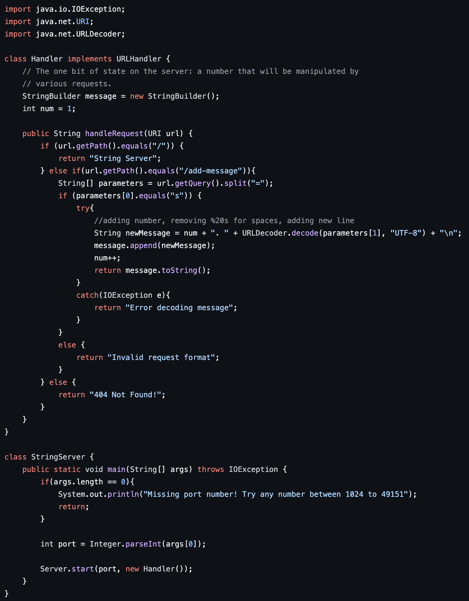
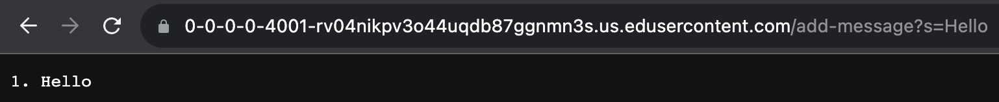
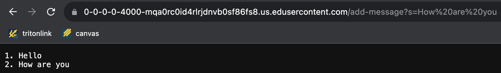
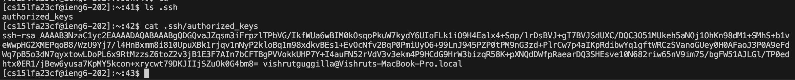
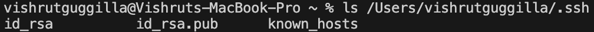
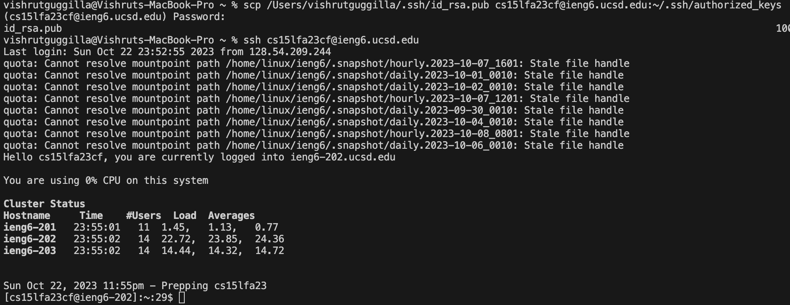

# Lab Report 2 - Servers and SSH Keys (Week 3)
**String Server Code**  \
  

---

**Add Messages Example 1** \
  

Methods Being Called and Their Arguments:  \
Within StringServer Main Method: 
- (Propety) `String[].length` used in `args.length` taking no arguments
- `System.out.println()` used in `System.out.println("Missing port number! Try any number between 1024 to 49151")` takes argument `"Missing port number! Try any number between 1024 to 49151"`
- `Integer.parseInt()` used in `Integer.parseInt(args[0])` takes the argument `args[0]` which equals `4000`
- `Server.start()` used in `Server.start(port, new Handler())` takes the int argument `port` and URLHandler `new Handler()`

Within StringServer HandleRequest Method:
- `URI.getPath.equals()` used in `url.getPath.equals("/")` and `url.getPath().equals("/add-message")` takes the String arguments `"/"` and `"/add-message"`
-  `URI.getQuery().split` used in `url.getQuery().split("=")` takes the String argument `"="`
-  `String.equals()` used in `parameters[0].equals("s")` takes the argument `"s"`
-  `URLDecoder.decode()` used in `URLDecoder.decode(parameters[1], "UTF-8")` takes the String arguments `parameters[1]` which equals `"Hello"` and `"UTF-8"` which is a character encoding
-  `StringBuilder.append()` used in `message.append(newMessage)` takes the String argument `newMessage` which equals `"1. Hello\n"`
-  `StringBuilder.toString()` used in `message.toString()` takes no arguments

Fields: 
- `StringBuilder message = new StringBuilder()`
- `int num = 1`

For this add, the URI being passed as an argument is `/add-message?s=Hello` and the int field `num = 1`, so the value of `String newMessage = "1. Hello"`, and this is appended to the StringBuilder message which is returned. In this case the URLDecode method decode returns `Hello`, the same as the original argument, as there are no spaces in the inputted URI. After this request, the int field `num` is updated to equal 2 and the StringBuilder field message is updated to equal `"1. Hello\n"`.

---

**Add Messages Example 2** \
  

Methods Being Called and Their Arguments:  \
Within StringServer Main Method: 
- (Propety) `String[].length` used in `args.length` taking no arguments
- `System.out.println()` used in `System.out.println("Missing port number! Try any number between 1024 to 49151")` takes argument `"Missing port number! Try any number between 1024 to 49151"`
- `Integer.parseInt()` used in `Integer.parseInt(args[0])` takes the argument `args[0]` which equals `4000`
- `Server.start()` used in `Server.start(port, new Handler())` takes the int argument `port` and URLHandler `new Handler()`

Within StringServer HandleRequest Method:
- `URI.getPath.equals()` used in `url.getPath.equals("/")` and `url.getPath().equals("/add-message")` takes the String arguments `"/"` and `"/add-message"`
-  `URI.getQuery().split` used in `url.getQuery().split("=")` takes the String argument `"="`
-  `String.equals()` used in `parameters[0].equals("s")` takes the argument `"s"`
-  `URLDecoder.decode()` used in `URLDecoder.decode(parameters[1], "UTF-8")` takes the String arguments `parameters[1]` which equals `"How%20are%20you"` and `"UTF-8"` which is a character encoding
-  `StringBuilder.append()` used in `message.append(newMessage)` takes the String argument `newMessage` which equals `"2. How are you\n"`
-  `StringBuilder.toString()` used in `message.toString()` takes no arguments

Fields: 
- `StringBuilder message = "1. Hello\n"`
- `int num = 2`

For this add, the URI being passed as an argument is `/add-message?s=How%20are%20you` and the int field `num = 2`. The value of String newMessage is `"2. How are you"` as the URLDecoder method decode, with the arguments of the message and `UTF=8`, removed the `%20s` and replaces them with spaces. This message is appended to the StringBuilder message, and message is returned. After this request, the int field `num` is updated to equal 3 and the StringBuilder field message is updated to equal `"1. Hello\n 2. How are you\n"`.

---

**Public Key Path** \
  
---

**Private Key Path** \

---

**Logging into ieng6 without password** \
  

---

Something I learned from Week 2 and 3 of CSE 15l is how to compile and start a server. By cloning a git repository, we can compile a server using the javac command with the files we are compiling and start it using the java command with the name of the server we are executing and a port number. Before Week 2's Lab, I had no idea how to run a server.
