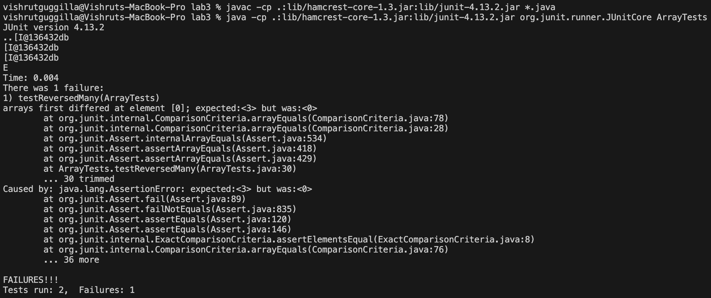
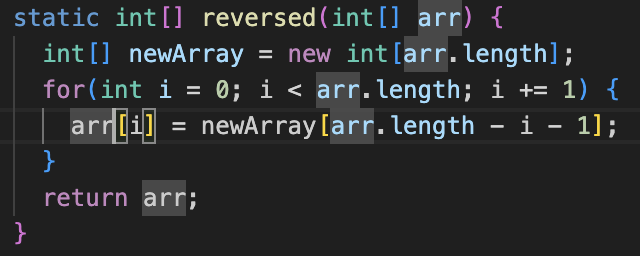
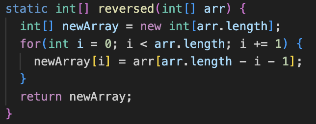
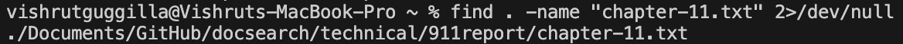
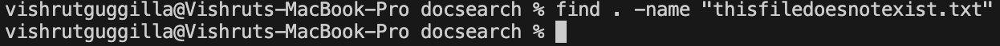
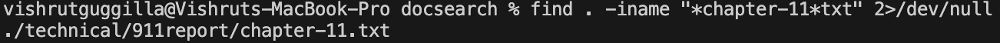
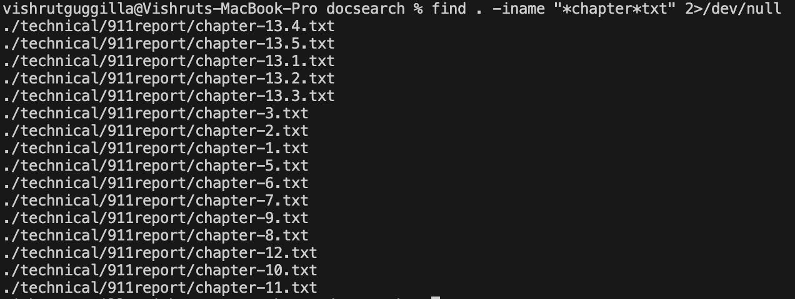
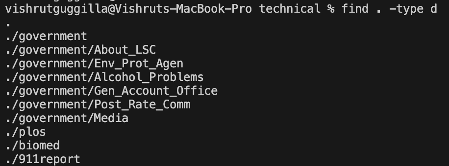
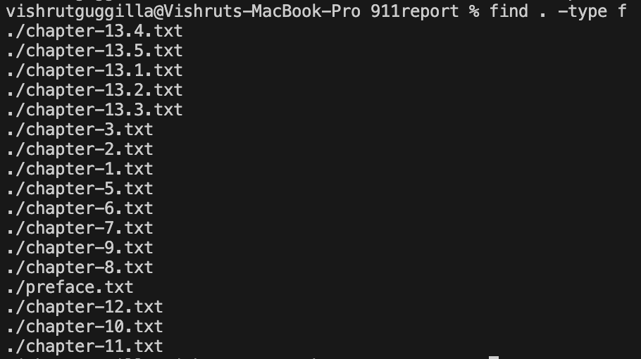

# Lab Report 3 - Bugs and Commands (Week 5)

**Failure Inducing Input for Buggy Reverse Program**   \

```
@Test
public void testReversedMany() {
  int[] input1 = {1, 2, 3};
  for(int i = 0; i < 3; i++){ System.out.println(ArrayExamples.reversed(input1));}
  assertArrayEquals(new int[]{3, 2, 1}, ArrayExamples.reversed(input1));
}
```

---
  
**Input That Does Not Induce Failure for Buggy Reverse Program**   \

```
@Test
public void testReversed() {
  int[] input1 = { };
  assertArrayEquals(new int[]{ }, ArrayExamples.reversed(input1));
}
```

---

**Symtom of Running Tests** \



---

**Buggy Code (Before)** \


**Code After** \


The fix between the before and after code addresses the issue as in the buggy code, as in the original code, `arr` is being set to the value of `newArray` at `[arr.length - i - 1]`, but `newArray` is filled with 0s as it was just initialized and has 0 as the value of each element as is the default for java. The new code works as it is iterating through the length of `arr` and setting the values of `newArray` equal to those of `arr` at `[arr.length - i - 1]` which would make `newArray` the reverse of `arr`, and then returning `newArray`.

---

**Find Command Options**
1. `-name`



The -name option for the find command helps you find a file when you know its name, but not where its stored. The first use above shows it giving the path to a file that was given, and the second screenshot shows it returning nothing because the file does not exist. The usage of 2>/dev/null silences permission errors.

2. -iname


The -iname option for the find command allows you to find the path to a file without exact capitilizaiton and for partial searches. In the first use above, it is giving the path to a file using the keywords of that file, and the second use is a more general search for text files containing `"chapter"` in their name, and it returns the paths to all such files.

3. -type


The -type option for the find command allows you to find based on the type such as file or directory. In the first use above, it is giving all the directories in the docsearch directory. In the second use, it is outputting all of the files within the technical directory.
