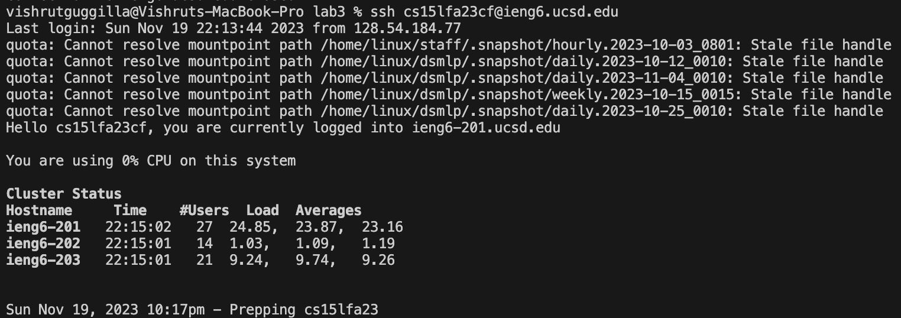
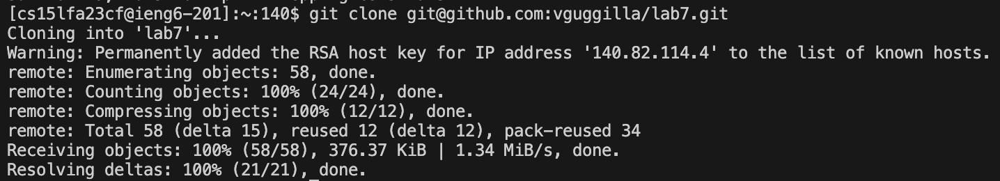
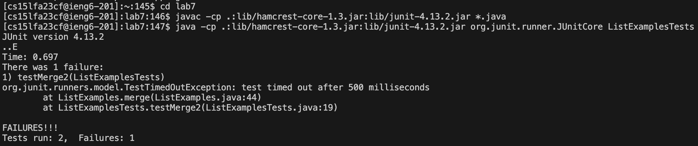
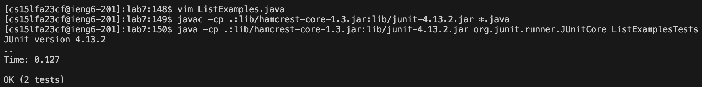
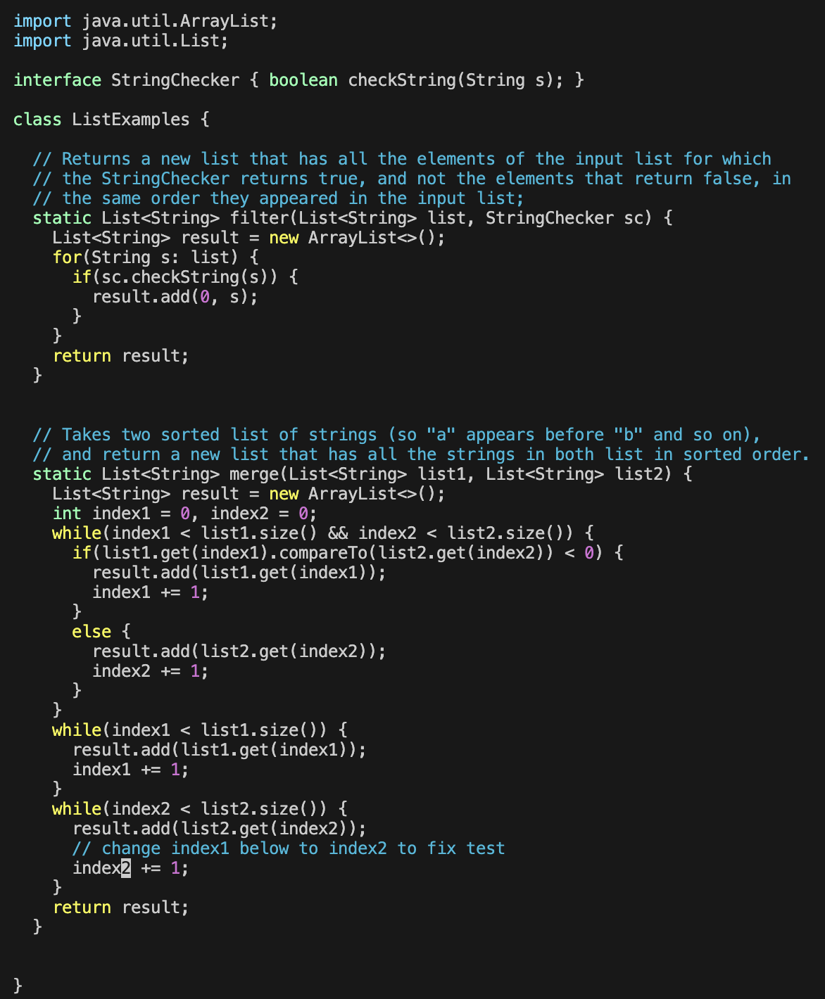
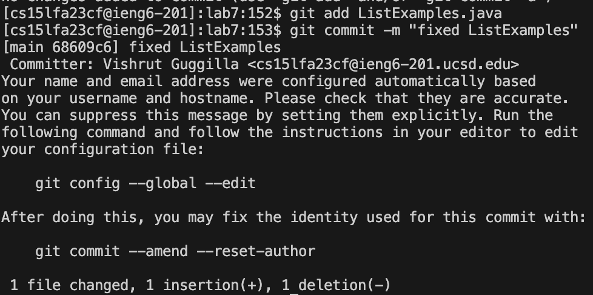

# Lab Report 4 - Vim (Week 7)

**Logging Into ieng6**

Typed out the ssh to login to ieng6. `<enter>`.

---

**Cloning Repo**

Copied ssh url from fork and git cloned. `<enter>`.

---

**Tests Failing**

Changed directory to lab7, then typed out javac command and `<enter>` and java command and `<enter>` to compile and run the tests. 

---

**Editing the Code and Running Tests Again**

Used vim to enter the ListExamples.java code file. Entered `<shift + g>` to go to the end of the file. Then `<up>``<up>``<up>``<up>``<up>``<up>``<e>``<right>` to navigate the the space after index1. `<i>` to enter insert mode, `<backspace>` `<2>` to replace index1 with index2. `<esc>` to exit insert mode `<:wq>` to save and exit.
`<up>``<up>``<up>` as the `javac -cp .:lib/hamcrest-core-1.3.jar:lib/junit-4.13.2.jar *.java` was three up in history then `<enter>`. `<up>``<up>``<up>` as the `java -cp .:lib/hamcrest-core-1.3.jar:lib/junit-4.13.2.jar org.junit.runner.JUnitCore ListExamplesTests` was three up in history then `<enter>`.

---

**Committing to Git**

Typed out git add command and `<enter>` and git commit command and `<enter>` to stage the ListExamples.java file and commit the changes to my Github account.

