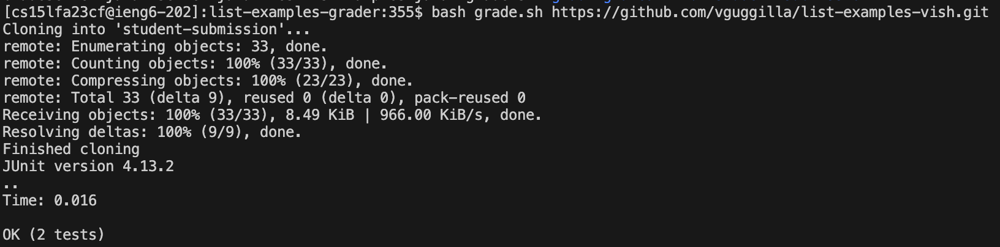
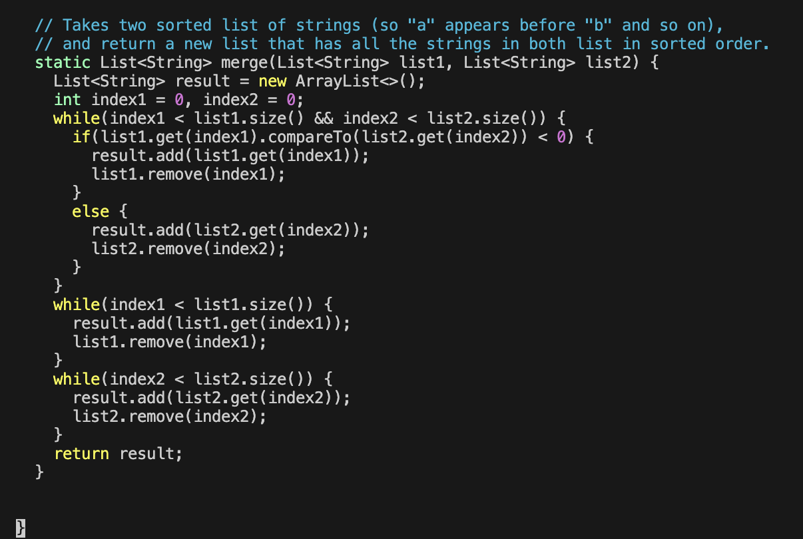
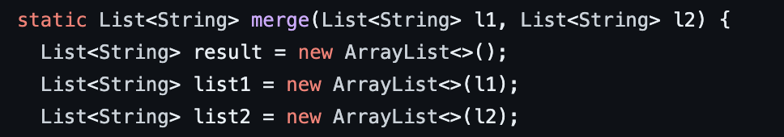

# Lab Report 5 - Putting it All Together (Week 9)

**Original Student Post**


When I test my ListExamples using grade.sh, I am receiving this output. I know the merge function is not working, and I see that it has to do with me using the remove function but I don't know the issue. 

---

**TA Response** \
The error you are getting is java.lang.UnsupportedOperationException for using the remove on an Abstract List at line 34. Maybe try using vim to take a look at what type of list you are calling remove on in your ListExamples file. 

---

**Information Gained**

The student will look at line 34 `list2.remove(index2);` and realize that they are calling remove on `list1` and `list2` which are Abstract Lists which is not allowed. This is the bug. A solution would be to create new Lists that are defined as ArrayLists copying the arguments like so: `List<String> al1 = new ArrayList<>(list1);`. Then calling all the functions on these Lists would make the code work. 

---

**Setup Information**
Files and Directory Structure Needed: 
 - `TestListExamples.java` containing the tests for ListExamples
 - `grade.sh` a bash script to test ListExamples using TestListExamples
 - a `lib` directory containing jar files for junit
 - a directory containing a `ListExamples.java` file with filter and merge methods

Contents before fixing the bug 

ListExamples.java:
```
import java.util.ArrayList;
import java.util.List;

interface StringChecker { boolean checkString(String s); }

class ListExamples {

  // Returns a new list that has all the elements of the input list for which
  // the StringChecker returns true, and not the elements that return false, in
  // the same order they appeared in the input list;
  static List<String> filter(List<String> list, StringChecker sc) {
    List<String> result = new ArrayList<>();
    for(String s: list) {
      if(sc.checkString(s)) {
        result.add(s);
      }
    }
    return result;
  }


  // Takes two sorted list of strings (so "a" appears before "b" and so on),
  // and return a new list that has all the strings in both list in sorted order.
  static List<String> merge(List<String> list1, List<String> list2) {
    List<String> result = new ArrayList<>();
    int index1 = 0, index2 = 0;
    while(index1 < list1.size() && index2 < list2.size()) {
      if(list1.get(index1).compareTo(list2.get(index2)) < 0) {
        result.add(list1.get(index1));
        list1.remove(index1);
      }
      else {
        result.add(list2.get(index2));
        list2.remove(index2);
      }
    }
    while(index1 < list1.size()) {
      result.add(list1.get(index1));
      list1.remove(index1);
    }
    while(index2 < list2.size()) {
      result.add(list2.get(index2));
      list2.remove(index2);
    }
    return result;
  }


}
```

grade.sh:
```
CPATH='.:../lib/hamcrest-core-1.3.jar:../lib/junit-4.13.2.jar'

rm -rf student-submission
rm -rf grading-area

mkdir grading-area

git clone $1 student-submission
echo 'Finished cloning'

if [[ ! -f 'student-submission/ListExamples.java' ]]
then 
    echo "Wrong file submitted"
    exit
fi

cp -r student-submission/ListExamples.java grading-area
cp TestListExamples.java grading-area
cd grading-area
javac -cp $CPATH *.java
java -cp $CPATH org.junit.runner.JUnitCore TestListExamples
```

TestListExamples.java
```
import static org.junit.Assert.*;
import org.junit.*;
import java.util.Arrays;
import java.util.List;

class IsMoon implements StringChecker {
  public boolean checkString(String s) {
    return s.equalsIgnoreCase("moon");
  }
}

public class TestListExamples {
  @Test(timeout = 500)
  public void testMergeRightEnd() {
    List<String> left = Arrays.asList("a", "b", "c");
    List<String> right = Arrays.asList("a", "d");
    List<String> merged = ListExamples.merge(left, right);
    List<String> expected = Arrays.asList("a", "a", "b", "c", "d");
    assertEquals(expected, merged);
  }

  @Test(timeout = 500)
  public void testFilterIsMoon() {
    List<String> test = Arrays.asList("MOON", "moOn", "notmoon", "moon");
    IsMoon sc = new IsMoon();
    List<String> result = ListExamples.filter(test, sc);
    List<String> expected = Arrays.asList("MOON", "moOn", "moon");
    assertEquals(expected, result);
  }
}
```

To fix the bug in ListExamples.java we can either use the method described above of copying the Lists given as arguments into Lists defined as Arraylists and calling the methods on them. 


Alternatively, we could switch the remove lines to `index1 += 1` or `index2 += 1` relative to which list is being edited.

---

**Reflection**
Something I learned from the second half of this quarter was just how much could be done from the command line. We can edit files and push them using vim and git add and commit, and figure out what needs to be edited more efficiently using jdb. I did not know that you could do this much just using the command line and find it really cool how efficient you can get using shortcuts and other tricks. 
